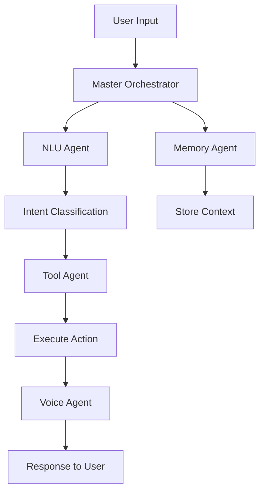

# Alice Agent System Documentation
*Agent Architecture för Alice Personal Assistant*

## 🤖 AGENT ÖVERSIKT

Alice använder en modulär agent-arkitektur där olika specialiserade agenter hanterar specifika uppgifter. Systemet bygger på principen om **single responsibility** där varje agent har ett tydligt definierat ansvarsområde.

## 🏗️ AGENT ARKITEKTUR

### Core Agent Framework
```
Agent System/
├── orchestrator.py        # 🎭 Master orchestrator - koordinerar agents
├── planner.py            # 📋 Task planning och uppdelning  
├── executor.py           # ⚡ Task execution engine
└── agents/
    ├── voice_agent.py    # 🎙️ Voice interaction specialist
    ├── nlu_agent.py      # 🧠 Natural Language Understanding
    ├── tool_agent.py     # 🔧 Tool execution specialist
    └── memory_agent.py   # 💾 Context och memory management
```

## 🎯 AGENT DEFINITIONER

### 1. 🎭 Master Orchestrator
**Syfte**: Koordinerar alla agents och hanterar high-level task routing

**Ansvar**:
- Tar emot user requests och analyserar intent
- Delegerar uppgifter till rätt specialist agents  
- Koordinerar multi-agent workflows
- Hanterar error handling och recovery

**Interface**:
```python
class MasterOrchestrator:
    async def process_request(self, user_input: str, context: Dict) -> Response
    async def delegate_task(self, task: Task, target_agent: str) -> Result
    async def coordinate_workflow(self, workflow: Workflow) -> Result
```

### 2. 🎙️ Voice Agent  
**Syfte**: Specialist på röstinteraktion och audio processing

**Ansvar**:
- Speech-to-text processing (Whisper integration)
- Text-to-speech generation (Piper + ffmpeg)
- Voice quality optimization och caching
- Audio stream management

**Interface**:
```python
class VoiceAgent:
    async def transcribe_audio(self, audio_stream: bytes) -> str
    async def synthesize_speech(self, text: str, voice: str) -> AudioResponse
    async def optimize_audio_quality(self, audio: bytes) -> bytes
    def get_supported_voices(self) -> List[str]
```

**Current Status**: ✅ **Production Ready**
- Real MP3 generation med ffmpeg
- WebSocket ASR integration
- 7/7 E2E tests passing
- Professional audio caching

### 3. 🧠 NLU Agent
**Syfte**: Natural Language Understanding och intent classification

**Ansvar**:
- Intent detection från user input
- Entity extraction (datum, email addresses, etc)
- Context understanding och conversation state
- Rule-based + LLM hybrid processing

**Interface**:
```python
class NLUAgent:
    async def classify_intent(self, text: str, context: Dict) -> Intent
    async def extract_entities(self, text: str) -> List[Entity]
    async def understand_context(self, conversation: List[Message]) -> Context
    def get_confidence_score(self, classification: Intent) -> float
```

**Current Status**: 🚧 **Under Development**
- Basic intent classification implementerat
- Needs rule-based engine + LLM fallback
- Entity extraction för svenska behövs

### 4. 🔧 Tool Agent
**Syfte**: Execution av externa tools och API-anrop

**Ansvar**:
- Dynamic tool discovery och loading
- Säker tool execution i sandbox environment  
- API integration (Gmail, Calendar, Weather)
- Result formatting och error handling

**Interface**:
```python
class ToolAgent:
    async def execute_tool(self, tool_name: str, params: Dict) -> ToolResult
    async def discover_tools(self) -> List[ToolInfo]
    def validate_tool_params(self, tool: str, params: Dict) -> bool
    async def sandbox_execute(self, tool_func: Callable, params: Dict) -> Result
```

**Current Status**: ⚠️ **Partially Implemented**
- Weather tool fungerar
- Timer tool implementation done
- Gmail/Calendar integration behövs
- Security sandbox behövs implementeras

### 5. 💾 Memory Agent
**Syfte**: Persistent memory och context management

**Ansvar**:
- User conversation history
- Personal preferences och settings
- Context retention mellan sessions
- Smart memory consolidation

**Interface**:
```python
class MemoryAgent:
    async def store_conversation(self, messages: List[Message]) -> bool
    async def get_relevant_context(self, query: str, limit: int) -> List[Context]
    async def update_user_preferences(self, prefs: Dict) -> bool
    async def consolidate_memory(self, timeframe: str) -> bool
```

**Current Status**: 📝 **Planned**
- SQLite persistence fungerar basic
- Redis integration för sessions planerad
- Smart context retrieval behövs
- Memory consolidation algorithm behövs

## 🔄 AGENT COMMUNICATION PATTERNS

### Request Flow


### Inter-Agent Protocol
```python
class AgentMessage:
    sender: str              # Agent ID som skickar
    recipient: str           # Target agent ID  
    message_type: str        # request, response, notification
    payload: Dict           # Actual message data
    correlation_id: str     # För request/response tracking
    timestamp: datetime     # När meddelandet skapades
```

## 🛡️ AGENT SECURITY MODEL

### Sandbox Execution
- Alla agent executions körs i isolerade environments
- Resource limits (CPU, memory, timeout)
- Network access restrictions per agent type
- Audit logging för alla agent actions

### Permission System
```python
class AgentPermissions:
    read_filesystem: bool = False
    write_filesystem: bool = False
    network_access: List[str] = []  # Allowed domains
    api_access: List[str] = []      # Allowed APIs
    max_execution_time: int = 30    # Seconds
    max_memory_mb: int = 100
```

## 📊 AGENT MONITORING

### Performance Metrics
- **Response Time**: Per agent execution time tracking
- **Success Rate**: Success/failure ratio per agent
- **Resource Usage**: CPU, memory, network per agent
- **Error Patterns**: Categorized error analysis

### Health Checks
```python
class AgentHealth:
    status: str              # healthy, degraded, unhealthy
    last_successful: datetime
    error_count_24h: int
    avg_response_time_ms: float
    resource_usage_pct: float
```

## 🚀 DEPLOYMENT STRATEGY

### Agent Lifecycle
1. **Discovery**: Auto-detection av available agents
2. **Registration**: Agent registrerar capabilities med orchestrator
3. **Health Check**: Continuous health monitoring
4. **Load Balancing**: Distribute load among healthy agents
5. **Graceful Shutdown**: Clean termination med pending task completion

### Configuration Management
```yaml
# agent_config.yaml
agents:
  voice_agent:
    enabled: true
    instances: 1
    max_memory_mb: 200
    timeout_seconds: 30
    
  nlu_agent:
    enabled: true  
    instances: 2
    llm_fallback: true
    confidence_threshold: 0.7
    
  tool_agent:
    enabled: true
    sandbox_mode: true
    allowed_apis: ["gmail", "calendar", "weather"]
```

## 🔧 DEVELOPMENT GUIDELINES

### Agent Implementation Standard
1. **Interface Contract**: Alla agents implementerar base `Agent` interface
2. **Error Handling**: Comprehensive error catching med structured logging
3. **Configuration**: Environment-based config med reasonable defaults
4. **Testing**: Unit tests + integration tests för varje agent
5. **Documentation**: API documentation med exempel

### Code Structure
```python
class BaseAgent:
    def __init__(self, config: AgentConfig):
        self.config = config
        self.logger = logging.getLogger(f"agent.{self.__class__.__name__}")
        
    async def initialize(self) -> bool:
        """Setup agent resources and connections"""
        pass
        
    async def health_check(self) -> AgentHealth:
        """Return current agent health status"""
        pass
        
    async def shutdown(self) -> bool:
        """Graceful shutdown with cleanup"""
        pass
```

## 📋 IMPLEMENTATION ROADMAP

### Phase 1: Core Agents (Current) ✅
- [x] Master Orchestrator basic implementation
- [x] Voice Agent production ready
- [x] Basic Tool Agent (weather, timer)

### Phase 2: Enhanced NLU (Next) 🚧  
- [ ] Rule-based intent classification
- [ ] Swedish entity extraction
- [ ] LLM fallback mechanism
- [ ] Conversation state management

### Phase 3: Advanced Tools (Planned) 📝
- [ ] Gmail API integration
- [ ] Calendar API integration  
- [ ] Security sandbox implementation
- [ ] Dynamic tool discovery

### Phase 4: Memory & Context (Future) 🔮
- [ ] Redis session management
- [ ] Smart context retrieval
- [ ] Memory consolidation algorithms
- [ ] Personal preference learning

---

*Detta dokument beskriver den modulära agent-arkitekturen som gör Alice skalbar och underhållbar. Varje agent har ett tydligt ansvarsområde och kan utvecklas independent.*