# 🏗️ Alice Architecture Documentation
*Portable Swedish AI Application Suite*

## 📋 Overview

Alice is architected as a **portable application suite** with clear separation between:
- **Applications Layer** (`apps/`) - Platform-specific user interfaces
- **Core Engine** (`core/`) - UI-agnostic processing and AI logic  
- **Shared Components** (`shared/`) - Common utilities and types

This design enables deployment across desktop, mobile, and web platforms while maintaining a consistent experience.

## 🎯 Design Principles

### 1. **UI-Agnostic Core**
The Alice Engine runs independently of any user interface, communicating through:
- **WebSocket API** - Real-time bidirectional communication
- **HTTP REST API** - Traditional request/response patterns
- **Talk-socket Protocol** - Voice I/O abstraction layer

### 2. **Platform-Native Applications**
Each platform gets a native application optimized for its ecosystem:
- **Desktop** - Electron/Tauri with OS integration
- **Mobile** - React Native with device features
- **Web** - PWA with modern browser capabilities

### 3. **Privacy-First Architecture**  
- **OS Keyring Integration** - Secure system-level credential storage
- **Safe Summary Filtering** - Privacy-aware data processing
- **Local AI Processing** - Sensitive operations stay on device
- **Controlled Data Boundaries** - Clear separation of local vs. cloud data

## 🏗️ System Architecture

```mermaid
graph TB
    subgraph "Applications Layer (apps/)"
        DA[🖥️ Desktop App<br/>Electron/Tauri]
        MA[📱 Mobile Apps<br/>React Native]
        WA[🌐 Web App<br/>Next.js PWA]
    end
    
    subgraph "Alice Engine (core/)"
        API[🔗 WebSocket/HTTP API]
        VG[🎤 Voice Gateway<br/>Talk-socket]
        AI[🧠 AI Core<br/>Harmony + Local LLM]
        MEM[💾 Memory System<br/>SQLite + Vector DB]
        TOOLS[🛠️ Tool Registry<br/>Pydantic Validation]
    end
    
    subgraph "Shared Components (shared/)"
        UI[🎨 UI Library<br/>Cross-platform]
        TYPES[📝 TypeScript Types]
        UTILS[⚙️ Utilities<br/>Common Functions]
    end
    
    subgraph "External Services"
        OS[🔐 OS Keyring]
        TTS[🔊 Piper TTS]
        LLM[🤖 Local Ollama]
        APIS[📡 External APIs<br/>Spotify, Calendar]
    end
    
    DA --> API
    MA --> API
    WA --> API
    
    API --> VG
    API --> AI
    API --> MEM
    API --> TOOLS
    
    VG --> TTS
    AI --> LLM
    TOOLS --> APIS
    
    DA --> UI
    MA --> UI
    WA --> UI
    
    AI --> OS
    
    style DA fill:#00d4ff,stroke:#0099cc,color:#000
    style MA fill:#ff6b6b,stroke:#e55353,color:#fff
    style WA fill:#4ecdc4,stroke:#3bb8b1,color:#000
    style API fill:#95e1d3,stroke:#6fd4c4,color:#000
```



## 📁 Directory Structure

```
Alice/
├── apps/                           # Platform-specific applications
│   ├── desktop/                   # Electron/Tauri desktop app
│   │   ├── src/
│   │   │   ├── main.ts           # Electron main process
│   │   │   ├── renderer.ts       # UI renderer process
│   │   │   └── preload.ts        # Secure bridge
│   │   ├── package.json
│   │   └── electron-builder.yml   # Build configuration
│   │
│   ├── mobile/                    # React Native mobile apps
│   │   ├── src/
│   │   │   ├── components/       # Mobile-specific components
│   │   │   ├── screens/          # Navigation screens
│   │   │   └── services/         # Native bridge services
│   │   ├── ios/                  # iOS-specific configuration
│   │   ├── android/              # Android-specific configuration
│   │   └── package.json
│   │
│   └── web/                       # Next.js PWA web app
│       ├── src/
│       │   ├── app/              # Next.js app router
│       │   ├── components/       # Web components
│       │   └── hooks/            # React hooks
│       ├── public/
│       ├── next.config.js
│       └── package.json
│
├── core/                          # Alice Engine (UI-agnostic)
│   ├── alice/
│   │   ├── engine/               # Core AI processing
│   │   │   ├── harmony.py        # AI adapter
│   │   │   ├── memory.py         # Memory management
│   │   │   └── orchestrator.py   # Task coordination
│   │   │
│   │   ├── voice/                # Voice processing
│   │   │   ├── talk_socket.py    # Voice I/O abstraction
│   │   │   ├── piper_tts.py      # Swedish TTS
│   │   │   └── asr.py            # Speech recognition
│   │   │
│   │   ├── tools/                # Tool system
│   │   │   ├── registry.py       # Tool management
│   │   │   ├── spotify.py        # Music control
│   │   │   └── calendar.py       # Calendar integration
│   │   │
│   │   └── api/                  # Communication layer
│   │       ├── websocket.py      # WebSocket handler
│   │       ├── http.py           # REST API
│   │       └── auth.py           # Authentication
│   │
│   ├── requirements.txt
│   └── main.py                   # Engine entry point
│
├── shared/                        # Cross-platform shared code
│   ├── ui/                       # Component library
│   │   ├── components/           # Reusable UI components
│   │   ├── styles/               # Design system
│   │   └── hooks/                # Shared React hooks
│   │
│   ├── types/                    # TypeScript definitions
│   │   ├── api.ts                # API interfaces
│   │   ├── voice.ts              # Voice system types
│   │   └── alice.ts              # Core Alice types
│   │
│   └── utils/                    # Common utilities
│       ├── config.ts             # Configuration management
│       ├── crypto.ts             # Encryption utilities
│       └── validation.ts         # Data validation
│
├── docs/                         # Documentation
├── scripts/                      # Build and deployment scripts
└── package.json                  # Root package configuration
```

## 🔗 Communication Architecture

### WebSocket API
Real-time bidirectional communication between applications and engine:

```typescript
interface AliceWebSocket {
  // Voice interactions
  startVoiceSession(): Promise<void>
  sendAudio(data: ArrayBuffer): void
  onAudioResponse(callback: (audio: ArrayBuffer) => void): void
  
  // Text interactions  
  sendMessage(message: string): Promise<string>
  onTyping(callback: () => void): void
  
  // System events
  onStatusChange(callback: (status: SystemStatus) => void): void
  onError(callback: (error: AliceError) => void): void
}
```

### HTTP REST API
Traditional request/response for stateless operations:

```typescript
interface AliceAPI {
  // Configuration
  GET    /api/config
  POST   /api/config
  
  // Tools and integrations
  GET    /api/tools
  POST   /api/tools/{tool}/execute
  
  // Memory system
  GET    /api/memory/search?q=query
  POST   /api/memory/add
  
  // Health and metrics
  GET    /api/health
  GET    /api/metrics
}
```

### Talk-socket Protocol
Voice I/O abstraction for cross-platform audio handling:

```typescript
interface TalkSocket {
  // Voice output
  speak(text: string, options?: SpeakOptions): Promise<void>
  stopSpeaking(): void
  
  // Voice input
  startListening(options?: ListenOptions): Promise<void>
  stopListening(): void
  onTranscript(callback: (text: string, final: boolean) => void): void
  
  // Audio control
  setVolume(level: number): void
  mute(enabled: boolean): void
  getAudioDevices(): AudioDevice[]
}
```

## 🔐 Security Architecture

### OS Keyring Integration
```typescript
// Secure credential storage
class AliceKeyring {
  async setCredential(service: string, key: string, value: string): Promise<void>
  async getCredential(service: string, key: string): Promise<string | null>
  async deleteCredential(service: string, key: string): Promise<void>
  async listCredentials(service: string): Promise<string[]>
}

// Usage examples
const keyring = new AliceKeyring()
await keyring.setCredential('alice-ai', 'openai-key', apiKey)
await keyring.setCredential('alice-ai', 'spotify-token', spotifyToken)
```

### Safe Summary Filter
```typescript
// Privacy-aware data processing
interface SafeSummary {
  original: string          // Full original content
  filtered: string         // Safe for external processing  
  sensitive: string[]      // Detected sensitive data
  confidence: number       // Detection confidence score
}

class SafeSummaryFilter {
  async filter(content: string): Promise<SafeSummary>
  configure(settings: PrivacySettings): void
}
```

### Data Flow Boundaries

```mermaid
graph LR
    subgraph "Local Processing"
        USER[👤 User Input]
        FILTER[🛡️ Safe Summary Filter]
        LOCAL[🏠 Local AI Engine]
    end
    
    subgraph "External Services"  
        CLOUD[☁️ Cloud APIs]
        SPOTIFY[🎵 Spotify]
        CALENDAR[📅 Calendar]
    end
    
    USER --> FILTER
    FILTER --> LOCAL
    FILTER -.-> CLOUD
    LOCAL --> SPOTIFY
    LOCAL --> CALENDAR
    
    style FILTER fill:#ff6b6b,stroke:#e55353,color:#fff
    style LOCAL fill:#4ecdc4,stroke:#3bb8b1,color:#000
```


## 🎤 Voice System Architecture

### Talk-socket Abstraction
The Talk-socket provides platform-agnostic voice I/O:

```python
# Core voice abstraction
class TalkSocket:
    def __init__(self, platform: Platform):
        self.tts = self._init_tts(platform)
        self.asr = self._init_asr(platform)
        self.audio = self._init_audio(platform)
    
    async def speak(self, text: str, voice: VoiceConfig = None):
        audio_data = await self.tts.synthesize(text, voice)
        await self.audio.play(audio_data)
    
    async def listen(self, callback: Callable[[str], None]):
        audio_stream = await self.audio.record()
        async for transcript in self.asr.transcribe(audio_stream):
            callback(transcript)
```

### Platform-Specific Audio
Each platform implements audio handling optimally:

```typescript
// Desktop (Electron)
class DesktopAudio {
  async record(): Promise<MediaStream>
  async play(data: ArrayBuffer): Promise<void>
  getDevices(): AudioDevice[]
}

// Mobile (React Native)
class MobileAudio {
  async record(): Promise<AudioRecording>  
  async play(data: ArrayBuffer): Promise<void>
  requestPermissions(): Promise<boolean>
}

// Web (Browser)
class WebAudio {
  async record(): Promise<MediaStream>
  async play(data: ArrayBuffer): Promise<void>
  checkWebRTCSupport(): boolean
}
```

## 🧠 AI Processing Architecture

### Harmony Adapter Pattern
```python
class HarmonyAdapter:
    """Unified interface for AI providers"""
    
    def __init__(self, config: AIConfig):
        self.local_llm = OllamaProvider(config.ollama)
        self.cloud_llm = OpenAIProvider(config.openai)
        self.router = IntentRouter()
    
    async def process(self, message: str, context: Context) -> Response:
        # Route to appropriate AI based on intent and privacy
        intent = await self.router.classify(message)
        
        if intent.requires_privacy or intent.complexity == "high":
            return await self.local_llm.process(message, context)
        else:
            return await self.cloud_llm.process(message, context)
```

### Memory System
```python
class AliceMemory:
    """Hybrid memory system with local storage"""
    
    def __init__(self, db_path: str):
        self.sqlite = SQLiteStore(db_path)
        self.vector_db = VectorStore(embeddings_model="local")
        self.cache = LRUCache(maxsize=1000)
    
    async def store(self, content: str, metadata: dict):
        # Store in both relational and vector databases
        embedding = await self.vector_db.embed(content)
        await self.sqlite.insert(content, metadata, embedding)
        
    async def search(self, query: str, limit: int = 10) -> List[MemoryItem]:
        # Hybrid search: vector similarity + metadata filtering
        query_embedding = await self.vector_db.embed(query)
        return await self.sqlite.search_hybrid(query_embedding, limit)
```

## 🛠️ Tool System Architecture

### Dynamic Tool Registry
```python
class ToolRegistry:
    """Pydantic-validated tool system"""
    
    def __init__(self):
        self.tools: Dict[str, Tool] = {}
        self.validators: Dict[str, BaseModel] = {}
    
    def register_tool(self, tool: Tool):
        # Validate tool interface with Pydantic
        validator = self._create_validator(tool)
        self.tools[tool.name] = tool
        self.validators[tool.name] = validator
    
    async def execute(self, tool_name: str, params: dict) -> ToolResult:
        # Validate parameters before execution
        validator = self.validators[tool_name]
        validated_params = validator(**params)
        
        tool = self.tools[tool_name]
        return await tool.execute(validated_params)
```

### Tool Implementation Example
```python
class SpotifyTool(Tool):
    name = "spotify_control"
    description = "Control Spotify music playback"
    
    class Parameters(BaseModel):
        action: Literal["play", "pause", "skip", "search"]
        query: Optional[str] = None
        
    async def execute(self, params: Parameters) -> ToolResult:
        spotify = SpotifyAPI(await get_token_from_keyring())
        
        if params.action == "play":
            await spotify.play()
        elif params.action == "search" and params.query:
            results = await spotify.search(params.query)
            return ToolResult(success=True, data=results)
            
        return ToolResult(success=True)
```

## 📊 Performance Architecture

### Resource Management
```typescript
interface SystemResources {
  cpu_usage: number        // Current CPU utilization %
  memory_usage: number     // Current memory usage MB  
  disk_usage: number       // Available disk space GB
  network_status: string   // Connection quality
  gpu_available: boolean   // Hardware acceleration
}

class ResourceMonitor {
  getSystemResources(): SystemResources
  onResourcesChange(callback: (resources: SystemResources) => void): void
  optimizeForPlatform(platform: Platform): void
}
```

### Caching Strategy
```python
class AliceCache:
    """Multi-layer caching system"""
    
    def __init__(self):
        self.memory_cache = LRUCache(maxsize=1000)      # Hot data
        self.disk_cache = DiskCache(max_size_gb=2)      # Warm data  
        self.vector_cache = VectorCache(similarity=0.9)  # Semantic cache
    
    async def get(self, key: str, generator: Callable = None):
        # Try memory first, then disk, then generate
        if result := self.memory_cache.get(key):
            return result
            
        if result := await self.disk_cache.get(key):
            self.memory_cache[key] = result
            return result
            
        if generator:
            result = await generator()
            await self.set(key, result)
            return result
            
        return None
```

## 🔄 State Management

### Application State
```typescript
// Zustand-based state management
interface AliceState {
  // Connection state
  connected: boolean
  connecting: boolean
  
  // Voice state
  listening: boolean
  speaking: boolean
  voiceEnabled: boolean
  
  // UI state
  sidebarOpen: boolean
  currentView: string
  theme: 'light' | 'dark'
  
  // System state
  resources: SystemResources
  notifications: Notification[]
}

const useAliceStore = create<AliceState>((set, get) => ({
  // Initial state
  connected: false,
  listening: false,
  speaking: false,
  
  // Actions
  setConnected: (connected: boolean) => set({ connected }),
  toggleListening: () => set(state => ({ listening: !state.listening })),
  addNotification: (notification: Notification) => 
    set(state => ({ notifications: [...state.notifications, notification] }))
}))
```

### Configuration Management
```typescript
class ConfigManager {
  private config: AliceConfig
  private watchers: Map<string, Function[]> = new Map()
  
  async load(platform: Platform): Promise<AliceConfig>
  async save(config: Partial<AliceConfig>): Promise<void>
  
  watch(key: string, callback: (value: any) => void): void
  unwatch(key: string, callback: Function): void
  
  // Platform-specific config paths
  getConfigPath(platform: Platform): string {
    switch (platform) {
      case 'desktop': return path.join(os.homedir(), '.alice', 'config.json')
      case 'mobile': return AsyncStorage.getItem('@alice:config')  
      case 'web': return localStorage.getItem('alice-config')
    }
  }
}
```

---

## 🎯 Architecture Benefits

### ✅ **Scalability**
- **Horizontal Scaling** - Multiple platform deployments
- **Vertical Scaling** - Resource-aware optimization
- **Modular Growth** - Add platforms and features independently

### ✅ **Maintainability**  
- **Clear Separation** - UI, logic, and data layers isolated
- **Shared Components** - Consistent experience across platforms
- **Type Safety** - TypeScript throughout the stack

### ✅ **Security**
- **Defense in Depth** - Multiple security layers
- **Privacy by Design** - Data boundaries built-in
- **Platform Security** - Native OS security features

### ✅ **Performance**
- **Local Processing** - Reduced latency and privacy
- **Intelligent Caching** - Multi-layer performance optimization
- **Platform Optimization** - Native performance on each platform

---

**Alice Architecture Philosophy**: Build once, deploy everywhere - with a UI-agnostic core enabling native applications across all platforms while maintaining security, performance, and the authentic Swedish AI experience.