# 🏗️ Alice FAS2 Architecture Documentation
*Event-Driven AI Assistant with Production-Ready Foundations*

## 📋 Overview

Alice FAS2 is architected as a **single, integrated Next.js application** with modular, event-driven components:
- **API Layer** (`app/api/`) - Next.js API routes for all system endpoints
- **Core System** (`src/`) - FAS2 implementation with event-driven architecture  
- **Memory System** (`data/`) - SQLite-based persistent storage
- **Telemetry** (`logs/`) - Complete system observability via NDJSON

This unified design provides production-ready AI assistance with built-in monitoring, memory, and context awareness.

## 🎯 FAS2 Design Principles

### 1. **Event-Driven Architecture**
All system interactions flow through a central EventBus:
- **Event Types** - `brain_compose`, `agent_response`, `tool_result`, `memory.write`
- **NDJSON Logging** - Complete telemetry to `logs/metrics.ndjson`
- **Real-time Monitoring** - System observability and performance tracking

### 2. **Memory-Enhanced AI**
Long-term memory system with artifact-based context:
- **SQLite Storage** - Production-grade persistence with WAL mode
- **Artifact System** - Scored, typed memories (insight, preference, policy)
- **Budget Control** - 25% token limit for context injection

### 3. **Integration-Tested Reliability**
100% validation through real endpoint testing:
- **E2E Integration Tests** - Test real system behavior, not mocks
- **Contract Validation** - API input/output format verification
- **Performance Monitoring** - Budget compliance and latency tracking

## 🏗️ FAS2 System Architecture

```mermaid
graph TB
    subgraph "Next.js Application (web/)"
        API[🔗 API Routes<br/>/api/brain/*, /api/memory/*]
        UI[🌐 Web Interface<br/>React Components]
        TEST[🧪 Test Interface<br/>test_fas_system.html]
    end
    
    subgraph "FAS2 Core (src/)"
        BRAIN[🧠 Brain Compose<br/>Context Injection]
        MEMORY[💾 Memory System<br/>SQLite + Artifacts]
        EVENT[📊 Event Bus<br/>Telemetry & Monitoring]
        PROMPT[📝 Prompt Builder<br/>Budget Control]
    end
    
    subgraph "Data Layer"
        DB[🗄️ SQLite Database<br/>artifacts, embeddings]
        LOGS[📋 NDJSON Logs<br/>metrics, events]
        CONFIG[⚙️ Configuration<br/>persona.yml, style.yml]
    end
    
    API --> BRAIN
    API --> MEMORY
    BRAIN --> EVENT
    MEMORY --> EVENT
    MEMORY --> DB
    EVENT --> LOGS
    PROMPT --> CONFIG
    
    subgraph "External Services"
        OPENAI[🤖 OpenAI API<br/>GPT-4o]
        TOOLS[🛠️ Tool APIs<br/>Weather, Timer]
    end
    
    BRAIN --> OPENAI
    API --> TOOLS
```



## 📊 FAS2 Implementation Status

### ✅ **Completed Phases (FAS 0-4)**

| Phase | Component | Implementation | Status |
|-------|-----------|----------------|--------|
| **FAS 0** | Environment | Environment vars, health endpoints | ✅ Complete |
| **FAS 1** | Strict TTS | Brain Compose API with structured responses | ✅ Complete |
| **FAS 2** | Event Bus | Central telemetry and NDJSON logging | ✅ Complete |
| **FAS 3** | Memory System | SQLite artifacts with score-based retrieval | ✅ Complete |
| **FAS 4** | Prompt Builder | Context injection with 25% budget control | ✅ Complete |

### 🔄 **Next Phases (FAS 5-8)**

| Phase | Component | Description | Timeline |
|-------|-----------|-------------|----------|
| **FAS 5** | Provider Switch | GPT-OSS primary, OpenAI fallback | Next |
| **FAS 6** | Cloud Complex | OpenAI Responses API integration | Q1 2025 |
| **FAS 7** | Brain Worker | Sentence streaming, background processing | Q1 2025 |
| **FAS 8** | Vision & Sensors | YOLO-driven presence detection | Q2 2025 |

## 🧩 Core Components Detail

### 🧠 Brain Compose System (FAS 1)
**Location:** `src/brain/compose.ts`, `app/api/brain/compose/route.ts`

**Purpose:** Structured response generation with context injection
```typescript
interface AnswerPackage {
  spoken_text: string;      // Exact output for TTS
  screen_text?: string;     // UI display text
  ssml?: string;           // Speech markup override
  citations?: Citation[];   // Source references
  meta?: ResponseMetadata; // Confidence, tone, metrics
}
```

**Features:**
- Context injection from memory artifacts
- Budget-controlled token usage (≤25%)
- Structured response format for consistency
- Integration with agent toolcalling

### 💾 Memory System (FAS 3)
**Location:** `src/memory/`, `app/api/memory/`

**Purpose:** Long-term learning and context persistence
```typescript
interface Artifact {
  id: string;
  userId: string;
  kind: ArtifactKind;      // insight, preference, policy, etc.
  text: string;
  score: number;           // 0-1 relevance score
  expiresAt?: string;      // Optional expiration
  meta?: Record<string, any>;
}
```

**Storage:**
- **SQLite Database** with WAL mode for production reliability
- **Artifact Types:** insight, kb_chunk, plan, policy, vision_event
- **Score-based Retrieval** for relevant context selection
- **Embedding Support** (stub implemented, ready for vector search)

### 📊 Event Bus & Telemetry (FAS 2)  
**Location:** `src/core/eventBus.ts`, `src/core/metrics.ts`

**Purpose:** Complete system observability and monitoring
```typescript
type EventType = 
  | "brain_compose" | "agent_response" | "tool_result" 
  | "memory.write" | "memory.fetch";

interface EventEnvelope<T> {
  type: EventType;
  ts: number;
  payload: T;
}
```

**Monitoring:**
- **NDJSON Logging** to `logs/metrics.ndjson`
- **Real-time Metrics** via `/api/metrics/summary`
- **Performance Tracking** - latency, budget compliance, tool usage
- **Error Tracking** - failures, timeouts, validation errors

### 📝 Prompt Builder & Budget Control (FAS 4)
**Location:** `src/core/promptBuilder.ts`

**Purpose:** Context injection with strict token budget control
```typescript
export async function buildPromptWithContext(
  userId: string, 
  userMessage: string
): Promise<{
  messages: ChatMessage[],
  stats: { injected_tokens_pct: number, artifacts_used: number }
}>
```

**Features:**
- **25% Token Budget** - Automatic enforcement and trimming
- **Artifact Integration** - Memory-based context injection  
- **Persona & Style** - YAML configuration loading
- **Budget Monitoring** - Real-time compliance tracking

## 🔗 API Architecture

### Core Endpoints
```bash
# Brain System (FAS 1)
POST /api/brain/compose          # Main response generation

# Memory System (FAS 3)  
POST /api/memory/write           # Store artifacts
POST /api/memory/fetch           # Retrieve by score

# Monitoring (FAS 2)
GET  /api/metrics/summary        # Performance metrics
GET  /api/health/simple          # System health

# Tools
POST /api/tools/weather.get      # Weather information
POST /api/tools/timer.set        # Timer management
```

### Request/Response Patterns
- **Consistent JSON** - All endpoints use structured JSON
- **Error Handling** - Standardized error responses with codes
- **Validation** - Input validation with meaningful error messages
- **Telemetry** - All requests logged to event system

## 🧪 Testing Architecture

### Integration-First Testing Strategy
**Why:** Mock tests lie, integration tests tell the truth.

```bash
# Primary validation
npm run test:integration         # E2E against live system
npm run test:integration:ci      # CI-friendly with timeout

# Interactive testing
http://localhost:3000/test_fas_system.html
```

### Test Coverage
- ✅ **API Contract Testing** - All endpoints validated
- ✅ **Memory Persistence** - Write/read cycles verified
- ✅ **Budget Compliance** - Token injection limits enforced
- ✅ **Tool Integration** - Weather, timer, agent functionality
- ✅ **Telemetry Collection** - Event logging verified

### Current Test Results
```
🧪 INTEGRATION TEST RESULTS
✅ Health Check: System responsive
✅ Memory System: Write/read cycle working
✅ Brain Compose: Budget 24.6% (within 25% target)
✅ Metrics Collection: Events properly logged
✅ Weather Tool: API validation successful
✅ Agent Integration: Response latency 826ms
🎯 Success Rate: 100%
```

## 🔧 Development Architecture

### Development Workflow
```bash
# Setup new development environment
cd Alice/web
npm install
cp .env.example .env.local     # Configure OpenAI API key
npm run dev                    # Start development server

# Validation workflow
npm run test:integration       # Must pass 100%
npm run build                  # Must compile cleanly
```

### File Structure
```
web/
├── src/                       # FAS2 Core Implementation
│   ├── brain/compose.ts      # FAS 1: Response generation
│   ├── core/
│   │   ├── eventBus.ts       # FAS 2: Event system
│   │   ├── metrics.ts        # FAS 2: NDJSON logging  
│   │   └── promptBuilder.ts  # FAS 4: Context injection
│   ├── memory/               # FAS 3: Persistence layer
│   │   ├── sqlite.ts         # Production SQLite driver
│   │   ├── inMemory.ts       # Development driver
│   │   └── types.ts          # Memory interfaces
│   └── types/                # Core type definitions
│       ├── answer.ts         # AnswerPackage interface
│       └── events.ts         # Event type definitions
├── app/api/                  # Next.js API Routes
│   ├── brain/compose/        # Main brain endpoint
│   ├── memory/{write,fetch}/ # Memory operations
│   ├── metrics/summary/      # Telemetry endpoint
│   └── health/simple/        # System health
├── alice/identity/           # Configuration
│   ├── persona.yml          # Alice personality
│   └── style.yml            # Response style
├── data/alice.db            # SQLite database
├── logs/metrics.ndjson      # Event log
└── tests/integration.test.js # E2E validation
```

## 🚀 Deployment Architecture

### Single Application Deployment
Alice FAS2 deploys as a single Next.js application:
- **No separate backend** - All logic in Next.js API routes
- **SQLite embedded** - Database travels with application
- **Static assets** - Built-in CDN via Next.js
- **Environment-based config** - Runtime configuration via `.env`

### Production Considerations
- **SQLite WAL mode** - Concurrent read/write performance
- **Event log rotation** - Prevent unbounded log growth
- **Memory cleanup** - Artifact expiration and cleanup
- **Health monitoring** - Built-in health and metrics endpoints

## 📈 Performance & Scalability

### Current Performance Profile
- **Budget Compliance:** 24.6% injection rate (target <25%) ✅
- **Memory Operations:** <100ms write/fetch latency ✅
- **API Response Times:** 826ms average agent latency ✅
- **Integration Success:** 100% test pass rate ✅

### Scalability Design
- **Event-driven architecture** - Horizontal scaling of event consumers
- **SQLite → PostgreSQL** - Easy migration path for higher concurrency
- **Memory system** - Artifact-based design scales to large context sets
- **API routes** - Standard Next.js scaling patterns apply

## 🔮 Future Architecture Evolution

### FAS 5-8 Architectural Changes
- **Provider Abstraction** - Multiple LLM backend support
- **Cloud Integration** - Hybrid local/cloud processing
- **Stream Processing** - Real-time response streaming  
- **Multi-modal Input** - Vision and sensor integration

### Long-term Vision
- **Federated Memory** - Cross-device memory synchronization
- **Plugin Architecture** - Third-party tool development
- **Autonomous Agents** - Background task execution
- **Enterprise Multi-tenancy** - Team and organization support

---

*Alice FAS2 represents a production-ready foundation for AI assistance, built on proven patterns of event-driven architecture, comprehensive testing, and observability-first design.*