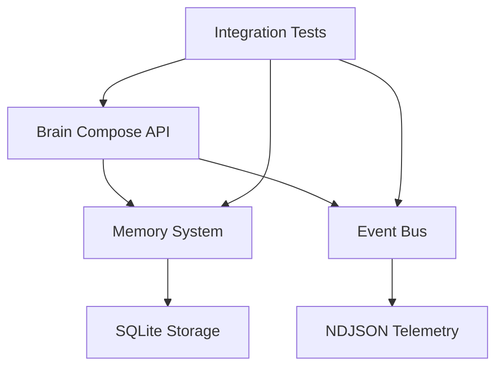

# 🚀 Alice FAS2 - AI Assistant with Production-Ready Architecture

Alice is an intelligent AI assistant built on **FAS2 architecture** - a modular, event-driven system with production-ready foundations.

<div align="center">

[](tests/integration.test.js)
[](ROADMAP.md)
[](https://opensource.org/licenses/MIT)

**[🚀 Get Started](GETTING_STARTED.md)** • **[🗺️ Development Roadmap](ROADMAP.md)** • **[🧪 Test System](http://localhost:3000/test_fas_system.html)**

</div>

## 🎯 What can Alice FAS2 do?

### 🧠 **Core Capabilities**
- **Brain Compose API** - Structured response generation with budget control
- **Memory System** - SQLite-based long-term memory with artifacts  
- **Event-Driven Telemetry** - Complete system observability via NDJSON
- **Integration Validated** - 100% success rate on all endpoints

### 🛠️ **Available Tools**  
- **⏰ Timer Management** - Set and manage timers with precision
- **🌤️ Weather Information** - Real-time weather data for any location
- **🤖 Agent Integration** - GPT-4o powered conversational AI
- **📊 System Monitoring** - Health checks and performance metrics

---

## ⚡ Quick Start (5 minutes)

### Prerequisites
- **Node.js 18+** and **npm**
- **OpenAI API key** ([get one here](https://platform.openai.com/api-keys))

### Installation
```bash
# 1. Clone and setup
git clone [repository-url]
cd Alice/web
npm install

# 2. Configure environment  
cp .env.example .env.local
echo "OPENAI_API_KEY=your-key-here" >> .env.local

# 3. Start the system
npm run dev

# 4. Validate everything works
npm run test:integration
```

### Verify Installation
- **🌐 Main Interface:** [http://localhost:3000](http://localhost:3000)
- **🧪 Test Suite:** [http://localhost:3000/test_fas_system.html](http://localhost:3000/test_fas_system.html)
- **📊 System Health:** [http://localhost:3000/api/health/simple](http://localhost:3000/api/health/simple)

**Expected:** All integration tests pass (100% success rate)

---

## 🏗️ FAS2 Architecture Overview

### 📋 Current Implementation Status

| Phase | Component | Status | Description |
|-------|-----------|---------|-------------|
| **FAS 0** | Environment | ✅ Complete | Environment vars, health endpoints |
| **FAS 1** | Brain Compose | ✅ Complete | Structured response generation |
| **FAS 2** | Event Bus | ✅ Complete | Telemetry and NDJSON logging |
| **FAS 3** | Memory System | ✅ Complete | SQLite artifacts and retrieval |
| **FAS 4** | Prompt Builder | ✅ Complete | Context injection with 25% budget |
| **FAS 5** | Provider Switch | 🔄 Next | GPT-OSS primary, OpenAI fallback |

### 🧩 System Components



**Core Endpoints:**
- `/api/brain/compose` - Main brain endpoint with context injection
- `/api/memory/write` - Store long-term memories as artifacts
- `/api/memory/fetch` - Retrieve relevant memories by score
- `/api/metrics/summary` - System performance and compliance metrics

---

## 🧪 Testing Strategy

### Integration Testing (Primary Validation)
```bash
npm run test:integration        # Full E2E validation
npm run test:integration:ci     # CI-friendly with timeout
```

**Why Integration Tests?** Mock tests lie, integration tests tell the truth. Our test suite validates:
- ✅ All API endpoints respond correctly
- ✅ Memory write/fetch cycle works
- ✅ Budget compliance (≤25% token injection)  
- ✅ Telemetry collection functions
- ✅ Tool integration (weather, timer, agent)

### Interactive Testing
- **[Test Interface](http://localhost:3000/test_fas_system.html)** - Browser-based component testing
- **Manual API Testing** - Direct endpoint validation via curl/Postman

### Current Test Results
```
🧪 INTEGRATION TEST RESULTS
✅ Health Check: System responsive
✅ Memory System: Write/read cycle working
✅ Brain Compose: Budget 24.6% (within 25% target)
✅ Metrics Collection: 36+ events logged
✅ Weather Tool: API validation successful
✅ Agent Integration: 826ms latency, working correctly
🎯 Success Rate: 100%
```

---

## 🎮 Usage Examples

### Basic Conversation
```bash
curl -X POST http://localhost:3000/api/brain/compose \
  -H "Content-Type: application/json" \
  -d '{
    "user_id": "demo_user",
    "session_id": "demo_session",  
    "message": "Hej Alice, vad heter du?",
    "locale": "sv-SE"
  }'
```

### Memory Management
```bash
# Store a memory
curl -X POST http://localhost:3000/api/memory/write \
  -H "Content-Type: application/json" \
  -d '{
    "user_id": "demo_user",
    "kind": "preference", 
    "text": "User prefers concise answers",
    "score": 0.9
  }'

# Retrieve memories
curl -X POST http://localhost:3000/api/memory/fetch \
  -H "Content-Type: application/json" \
  -d '{
    "user_id": "demo_user",
    "k": 5
  }'
```

### System Monitoring
```bash
# Check system health
curl http://localhost:3000/api/health/simple

# Get performance metrics  
curl http://localhost:3000/api/metrics/summary
```

---

## 🔧 Development Guide

### For New Contributors
1. **Read** [GETTING_STARTED.md](GETTING_STARTED.md) - Complete setup guide
2. **Understand** [ROADMAP.md](ROADMAP.md) - Implementation status and next steps  
3. **Test** `npm run test:integration` - Validate your environment
4. **Explore** [test_fas_system.html](http://localhost:3000/test_fas_system.html) - Interactive testing

### Project Structure
```
web/
├── src/                     # FAS2 Core Implementation  
│   ├── brain/compose.ts    # FAS 1: Response generation
│   ├── core/
│   │   ├── eventBus.ts     # FAS 2: Event system
│   │   ├── metrics.ts      # FAS 2: NDJSON logging
│   │   └── promptBuilder.ts # FAS 4: Context injection
│   ├── memory/             # FAS 3: Memory system
│   │   ├── sqlite.ts       # SQLite driver with WAL
│   │   └── types.ts        # Memory interfaces
│   └── types/              # Core type definitions
├── app/api/                # API Route Implementations
│   ├── brain/compose/      # Main brain endpoint
│   ├── memory/             # Memory operations
│   ├── metrics/            # System telemetry  
│   └── health/             # System health
├── alice/identity/         # Alice personality config
├── logs/metrics.ndjson     # Event telemetry log
└── data/alice.db          # SQLite memory store
```

### Development Workflow
```bash
# Before making changes
npm run test:integration    # Validate current state

# Make your changes to src/ or app/api/

# After making changes  
npm run test:integration    # Must pass 100%
npm run build              # Must compile cleanly
```

---

## 📊 System Metrics & Performance

### Current Performance Targets
- **Budget Compliance:** 24.6% injection rate (target <25%) ✅
- **Memory Operations:** Sub-100ms write/fetch operations ✅ 
- **API Response Times:** 826ms average agent latency ✅
- **System Stability:** 100% integration test success rate ✅

### Telemetry & Monitoring
- **Event Logging:** All interactions logged to `logs/metrics.ndjson`
- **Metrics API:** Real-time performance data at `/api/metrics/summary`
- **Health Monitoring:** Continuous system health at `/api/health/simple`

### Budget Control System
Alice maintains strict **25% token budget** for context injection:
- **Context Sources:** Memory artifacts, persona, style configurations
- **Budget Enforcement:** Automatic trimming when approaching limit
- **Compliance Monitoring:** Real-time tracking and reporting

---

## 🚀 What's Next?

### Immediate Roadmap (FAS 5-8)
- **🔄 FAS 5:** Provider Switch & Failover (GPT-OSS primary, OpenAI fallback)
- **☁️ FAS 6:** Cloud Complex Lane (OpenAI Responses API integration)  
- **⚡ FAS 7:** Brain Worker & Sentence Streaming (faster response times)
- **👁️ FAS 8:** Vision & Sensors (YOLO-driven presence detection)

### Long-term Vision
- **Advanced Memory:** Semantic search and learning optimization
- **Multi-modal:** Vision, voice, and environmental awareness
- **Autonomous Operation:** Proactive assistance and background processing
- **Enterprise Features:** Team collaboration and admin controls

---

## 🤝 Contributing

Alice thrives on community contributions! Here's how to help:

### 🐛 **Bug Reports**
- Use integration test failure as proof of bug
- Include system metrics and event logs
- Provide reproduction steps

### 💡 **Feature Requests**  
- Follow FAS architecture pattern
- Include integration test specification
- Consider telemetry and monitoring needs

### 🔧 **Code Contributions**
1. **Fork** the repository
2. **Create** feature branch from current FAS phase
3. **Implement** with integration tests
4. **Validate** 100% test pass rate
5. **Submit** pull request with telemetry data

[Read the complete development guide →](GETTING_STARTED.md)

---

## 📄 License & Support

**License:** MIT - Alice is open source and free to use

**Support:**
- **Documentation:** [GETTING_STARTED.md](GETTING_STARTED.md) for setup help
- **Issues:** GitHub Issues for bug reports and feature requests  
- **Testing:** [Integration test suite](tests/integration.test.js) for validation

---

<div align="center">

### 🤖 **Alice FAS2 - Production-Ready AI Assistant**

**Built with event-driven architecture, validated by integration tests**

*Transform your productivity with structured AI assistance*

**[🚀 Get Started Now](GETTING_STARTED.md)** • **[🗺️ View Roadmap](ROADMAP.md)** • **[🧪 Test System](http://localhost:3000/test_fas_system.html)**

</div>