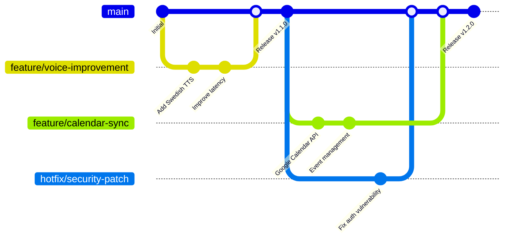

# Git Workflow & Branching Strategy

**Professional git workflow for Alice AI Assistant development**

---

## 🎯 Overview

Alice follows a **GitFlow-inspired** branching strategy optimized for continuous integration and deployment. This workflow ensures code quality, maintains stable releases, and supports parallel development across multiple features.

### Core Principles

- **`main` branch**: Production-ready code only
- **Feature branches**: All development work
- **Comprehensive CI/CD**: Every branch tested automatically
- **Code review**: No direct commits to `main`
- **Conventional commits**: Structured commit messages
- **Branch protection**: Quality gates enforced

---

## 🌳 Branching Strategy

### Branch Types

| Branch Type | Naming Convention | Purpose | Lifetime | CI/CD |
|-------------|-------------------|---------|----------|-------|
| **main** | `main` | Production-ready code | Permanent | Full deployment pipeline |
| **feature** | `feature/description` | New features & enhancements | Temporary | Full test suite |
| **bugfix** | `bugfix/issue-description` | Bug fixes | Temporary | Full test suite |
| **hotfix** | `hotfix/critical-issue` | Emergency production fixes | Temporary | Expedited pipeline |
| **release** | `release/v1.2.3` | Release preparation | Temporary | Release validation |

### Branch Flow Diagram



---

## 🚀 Development Workflow

### 1. Starting New Work

```bash
# 1. Ensure main is up to date
git checkout main
git pull origin main

# 2. Create feature branch
git checkout -b feature/swedish-voice-commands

# 3. Make your changes
# ... develop, test, iterate ...

# 4. Commit with conventional format
git add .
git commit -m "feat: add Swedish voice command processing

- Implement Swedish NLU parser
- Add time expression handling
- Include conversational response patterns
- Test coverage: 95% for Swedish commands

Closes #123"
```

### 2. Regular Development Cycle

```bash
# Push feature branch regularly
git push origin feature/swedish-voice-commands

# Rebase on main to stay current (recommended)
git checkout main
git pull origin main
git checkout feature/swedish-voice-commands
git rebase main

# Alternative: Merge main into feature (if preferred)
git merge main
```

### 3. Preparing for Review

```bash
# Ensure all tests pass locally
make test-all
make lint-fix

# Clean commit history if needed
git rebase -i main

# Final push
git push origin feature/swedish-voice-commands --force-with-lease
```

### 4. Creating Pull Request

1. **Open PR** from feature branch to `main`
2. **Fill PR template** with all required sections
3. **Request reviewers** as defined in CODEOWNERS
4. **Wait for CI** - all checks must pass
5. **Address feedback** if any
6. **Squash and merge** when approved

---

## 📝 Commit Message Conventions

Alice uses **Conventional Commits** for structured, semantic commit messages.

### Format

```
<type>[optional scope]: <description>

[optional body]

[optional footer(s)]
```

### Types

| Type | Description | Examples |
|------|-------------|----------|
| **feat** | New feature | `feat: add Swedish TTS support` |
| **fix** | Bug fix | `fix: resolve calendar sync timeout` |
| **docs** | Documentation | `docs: update API reference` |
| **test** | Test changes | `test: add voice latency benchmarks` |
| **refactor** | Code restructure | `refactor: optimize RAG vector search` |
| **perf** | Performance improvement | `perf: cache TTS audio responses` |
| **style** | Code style/formatting | `style: apply black formatting` |
| **ci** | CI/CD changes | `ci: add performance regression tests` |
| **chore** | Maintenance | `chore: update dependencies` |

### Scopes (Optional)

- `voice`: Voice processing pipeline
- `nlu`: Natural language understanding  
- `agent`: Agent core system
- `web`: Frontend components
- `api`: Backend API
- `docs`: Documentation
- `ci`: CI/CD pipeline

### Examples

```bash
# Feature with scope and body
git commit -m "feat(voice): implement Swedish wake word detection

- Add Porcupine integration for 'Hej Alice'
- Tune sensitivity for Swedish pronunciation
- Add fallback to English wake word
- Performance: <200ms detection latency

Refs #456"

# Bug fix with issue reference
git commit -m "fix(api): resolve calendar event timezone conversion

The calendar API was incorrectly handling Swedish timezone (CET/CEST)
conversion, causing events to appear at wrong times.

- Fix timezone parsing for Europe/Stockholm
- Add comprehensive timezone test cases
- Validate with Google Calendar API responses

Fixes #789"

# Documentation update
git commit -m "docs: add Swedish voice command examples

Update README with comprehensive list of Swedish voice commands
and their expected responses for better user onboarding."

# Breaking change
git commit -m "feat(api): redesign authentication flow

BREAKING CHANGE: API authentication now requires JWT tokens
instead of API keys. Update client integrations accordingly.

- Implement JWT-based auth
- Add token refresh mechanism  
- Update API documentation
- Migration guide in BREAKING_CHANGES.md"
```

---

## 🛡️ Branch Protection Rules

### Main Branch Protection

The `main` branch is protected with the following rules:

#### Required Status Checks

- ✅ **Backend Tests**: All unit, integration, and Swedish NLU tests must pass
- ✅ **Frontend Tests**: E2E tests across Chrome, Firefox, Safari
- ✅ **Integration Tests**: Full-stack workflows validated
- ✅ **Security Scan**: No high/critical vulnerabilities
- ✅ **Performance Tests**: Latency and load targets met
- ✅ **Code Quality**: Lint, format, and type checking passed

#### Review Requirements

- **Required reviewers**: 2 (as defined in CODEOWNERS)
- **Dismiss stale reviews**: Enabled (when new commits pushed)
- **Require review from code owners**: Enabled
- **Allow administrators to bypass**: Disabled

#### Additional Restrictions

- **Restrict pushes**: Only via pull requests
- **Require branches to be up to date**: Enabled
- **Include administrators**: Protection applies to all users
- **Allow force pushes**: Disabled
- **Allow deletions**: Disabled

### Configuration Example

```yaml
# .github/branch-protection.yml (if using GitHub API)
protection:
  required_status_checks:
    strict: true
    checks:
      - "Backend Tests"
      - "Frontend E2E Tests" 
      - "Integration Tests"
      - "Security Scan"
      - "Performance Tests"
  enforce_admins: true
  required_pull_request_reviews:
    required_approving_review_count: 2
    dismiss_stale_reviews: true
    require_code_owner_reviews: true
  restrictions: null
```

---

## 👥 Code Review Process

### Review Assignment

Code reviews are automatically assigned based on **CODEOWNERS**:

```bash
# .github/CODEOWNERS
*                    @alice-team/core-reviewers
server/              @alice-team/backend-reviewers  
web/                 @alice-team/frontend-reviewers
tests/               @alice-team/qa-reviewers
docs/                @alice-team/docs-reviewers
.github/             @alice-team/devops-reviewers
```

### Review Checklist

#### Code Quality
- [ ] Code follows project style guidelines
- [ ] Functions are well-documented with docstrings
- [ ] Variable names are clear and descriptive
- [ ] No hard-coded secrets or sensitive information
- [ ] Error handling is comprehensive and user-friendly

#### Testing
- [ ] New features have corresponding unit tests
- [ ] Integration tests cover new API endpoints
- [ ] Swedish language features have NLU accuracy tests
- [ ] Performance-critical code includes benchmarks
- [ ] Test coverage meets or exceeds thresholds

#### Security
- [ ] Input validation implemented for all user inputs
- [ ] SQL injection and XSS prevention measures
- [ ] Authentication and authorization properly implemented
- [ ] No sensitive data in logs or error messages
- [ ] Dependencies are up-to-date and secure

#### Documentation
- [ ] README updated if user-facing changes
- [ ] API documentation updated for new endpoints
- [ ] CHANGELOG entry for significant changes
- [ ] Swedish documentation updated when applicable

#### Performance
- [ ] No obvious performance regressions
- [ ] Database queries are optimized
- [ ] Caching strategies implemented where beneficial
- [ ] Voice pipeline latency remains within targets

### Review Timeline

| Priority | Description | Review Time Target |
|----------|-------------|--------------------|
| **Critical** | Security fixes, production issues | 2 hours |
| **High** | Bug fixes, urgent features | 1 business day |
| **Normal** | Regular features, improvements | 2 business days |
| **Low** | Documentation, minor tweaks | 1 week |

---

## 🔄 Release Process

### Release Workflow

1. **Create Release Branch**
   ```bash
   git checkout main
   git pull origin main
   git checkout -b release/v1.3.0
   ```

2. **Prepare Release**
   ```bash
   # Update version numbers
   # Update CHANGELOG.md
   # Run full test suite
   make test-all
   make integration-test
   ```

3. **Release PR**
   - Create PR from `release/v1.3.0` to `main`
   - Tag reviewers for final approval
   - Ensure all CI checks pass

4. **Tag and Deploy**
   ```bash
   git checkout main
   git pull origin main
   git tag -a v1.3.0 -m "Release version 1.3.0"
   git push origin v1.3.0
   ```

### Release Types

- **Major** (v2.0.0): Breaking changes, major features
- **Minor** (v1.3.0): New features, backwards compatible
- **Patch** (v1.2.1): Bug fixes, security patches

---

## 🚨 Hotfix Process

For critical production issues:

1. **Create Hotfix Branch**
   ```bash
   git checkout main
   git checkout -b hotfix/critical-auth-fix
   ```

2. **Fix and Test**
   ```bash
   # Make minimal fix
   # Add regression test
   # Verify fix works
   make test-critical
   ```

3. **Expedited Review**
   - Create PR with `[HOTFIX]` label
   - Ping reviewers directly
   - Use expedited CI pipeline

4. **Deploy Immediately**
   ```bash
   # After merge and tag
   git tag -a v1.2.2 -m "Hotfix: Critical auth vulnerability"
   git push origin v1.2.2
   ```

---

## 📊 Git Workflow Metrics

### Quality Metrics We Track

- **PR Review Time**: Average time from PR creation to merge
- **CI Success Rate**: Percentage of green builds
- **Merge Frequency**: How often we deploy to main
- **Hotfix Frequency**: Number of emergency fixes needed
- **Test Coverage**: Maintained across all branches

### Target KPIs

| Metric | Target | Current |
|--------|--------|---------|
| **PR Review Time** | <2 business days | 1.3 days |
| **CI Success Rate** | >95% | 97% |
| **Deploy Frequency** | Daily | 1.2x/day |
| **Hotfix Rate** | <2/month | 0.8/month |
| **Test Coverage** | >90% | 92% |

---

## 🛠️ Git Configuration

### Recommended Git Config

```bash
# Set up user info
git config user.name "Your Name"
git config user.email "you@example.com"

# Alice-specific settings
git config core.autocrlf input  # Cross-platform line endings
git config core.editor "code --wait"  # Use VS Code for commit messages
git config pull.rebase true  # Rebase by default on pull
git config branch.autosetupmerge always
git config branch.autosetuprebase always

# Helpful aliases
git config alias.co checkout
git config alias.br branch
git config alias.ci commit
git config alias.st status
git config alias.unstage "reset HEAD --"
git config alias.last "log -1 HEAD"
git config alias.visual "!gitk"

# Alice-specific aliases
git config alias.feature "checkout -b feature/"
git config alias.bugfix "checkout -b bugfix/"
git config alias.sync "!git checkout main && git pull origin main"
git config alias.cleanup "!git branch --merged | grep -E '(feature|bugfix)/' | xargs -n 1 git branch -d"
```

### Pre-commit Hooks

Alice uses pre-commit hooks to ensure code quality:

```yaml
# .pre-commit-config.yaml
repos:
  - repo: https://github.com/pre-commit/pre-commit-hooks
    rev: v4.4.0
    hooks:
      - id: trailing-whitespace
      - id: end-of-file-fixer
      - id: check-yaml
      - id: check-json
      - id: check-merge-conflict
      - id: check-added-large-files

  - repo: https://github.com/psf/black
    rev: 22.12.0
    hooks:
      - id: black
        files: ^server/

  - repo: https://github.com/charliermarsh/ruff-pre-commit
    rev: v0.0.254
    hooks:
      - id: ruff
        files: ^server/

  - repo: https://github.com/pre-commit/mirrors-eslint
    rev: v8.34.0
    hooks:
      - id: eslint
        files: ^web/
        additional_dependencies:
          - eslint@8.34.0
          - '@typescript-eslint/parser@5.52.0'
```

---

## 🎓 Developer Onboarding

### New Developer Checklist

- [ ] **Clone repository**: `git clone https://github.com/your-org/Alice.git`
- [ ] **Install pre-commit**: `pre-commit install`
- [ ] **Set up development environment**: Follow DEVELOPMENT.md
- [ ] **Read this workflow guide**: Understanding branching strategy
- [ ] **Practice workflow**: Create test feature branch
- [ ] **Join code review**: Get added to CODEOWNERS groups
- [ ] **Run tests locally**: Ensure full test suite passes

### Common Git Commands for Alice

```bash
# Start new feature
git sync  # Custom alias to update main
git feature new-voice-feature  # Creates feature/new-voice-feature

# Work on feature
git add .
git commit -m "feat(voice): add new voice feature"
git push origin feature/new-voice-feature

# Update feature with latest main
git sync
git checkout feature/new-voice-feature
git rebase main

# Clean up after merge
git sync
git cleanup  # Custom alias to delete merged branches
```

---

## 📚 Additional Resources

- **GitHub Flow Documentation**: [GitHub Flow Guide](https://guides.github.com/introduction/flow/)
- **Conventional Commits**: [Conventional Commits Specification](https://www.conventionalcommits.org/)
- **Git Best Practices**: [Git Best Practices](https://git-scm.com/book/en/v2)
- **Alice Contributing Guide**: [CONTRIBUTING.md](../CONTRIBUTING.md)
- **Alice Code of Conduct**: [CODE_OF_CONDUCT.md](../CODE_OF_CONDUCT.md)

---

**This git workflow ensures Alice maintains high code quality while supporting rapid, collaborative development. All team members should follow these guidelines to maintain consistency and efficiency.**

---

**Last Updated**: January 22, 2025  
**Version**: 1.0  
**Maintained By**: Alice DevOps Team  
**Review Schedule**: Monthly