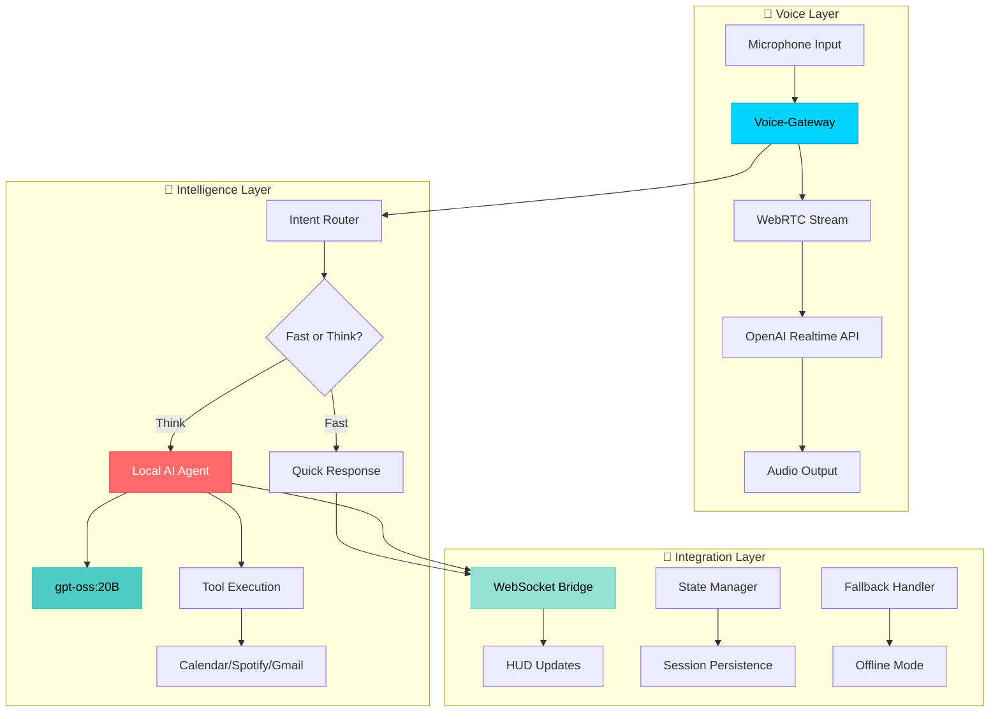
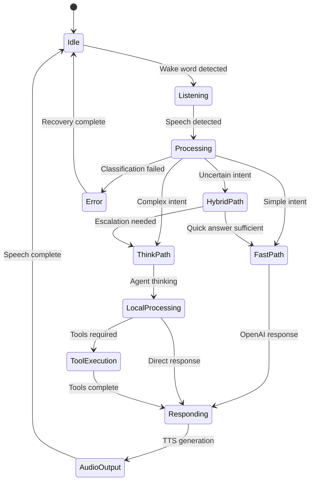
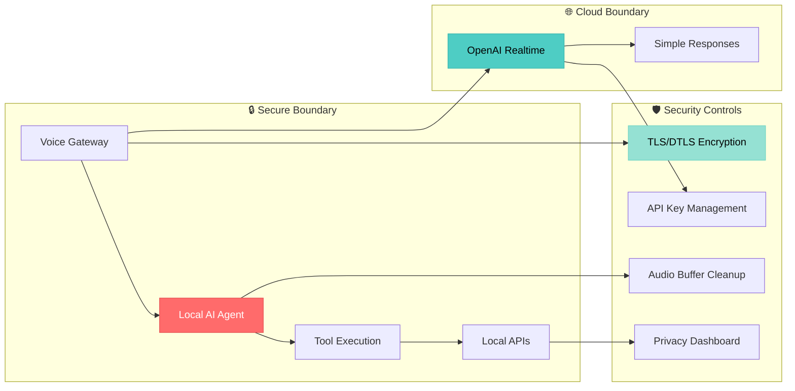

# 🎙️ Alice Voice Hybrid Architecture - Snappy Voice, Local Thinking

**Complete technical specification for Alice's revolutionary hybrid voice architecture combining OpenAI Realtime streaming with local AI thinking.**

> **🇸🇪 Svenska:** [docs/sv/VOICE_HYBRID_ARCHITECTURE.md](sv/VOICE_HYBRID_ARCHITECTURE.md) - Full Swedish version available

---

## 🏗️ **Architecture Overview**

Alice's Hybrid Voice Architecture represents a breakthrough in AI assistant design, combining the best of cloud-based real-time voice processing with local AI intelligence for optimal performance, privacy, and cost-effectiveness.

### Core Design Philosophy

**"Snappy Voice, Local Thinking"** - Leverage OpenAI's world-class Realtime API for ultra-low latency voice interaction while maintaining deep thinking, tool execution, and complex reasoning locally using gpt-oss:20B.



---

## 🎯 **Key Components**

### 1. Voice-Gateway
**Purpose**: Central orchestration hub for all voice interactions

```typescript
interface VoiceGateway {
  // WebSocket connections
  openaiRealtimeConnection: WebRTCConnection
  aliceBackendConnection: WebSocketConnection
  hudConnection: WebSocketConnection
  
  // Audio pipeline
  audioProcessor: AudioProcessor
  noiseReduction: NoiseReductionEngine
  echoCancellation: EchoCancellationEngine
  
  // Intent routing
  intentRouter: IntentRouter
  responseClassifier: ResponseClassifier
  
  // State management
  sessionManager: SessionManager
  conversationState: ConversationState
}
```

**Responsibilities**:
- **Audio Stream Management**: Handle WebRTC streams to/from OpenAI Realtime
- **Intent Classification**: Real-time classification of user intents during speech
- **Response Routing**: Decide between fast OpenAI responses vs. local AI processing
- **State Synchronization**: Maintain conversation state across all components
- **Error Recovery**: Graceful degradation when components fail

### 2. Intent Router
**Purpose**: Intelligent routing between fast responses and deep thinking

```python
class IntentRouter:
    def __init__(self):
        self.fast_intents = {
            'GREETING', 'ACKNOWLEDGMENT', 'CLARIFICATION',
            'SIMPLE_QUESTION', 'WEATHER', 'TIME_DATE'
        }
        self.think_intents = {
            'CALENDAR_COMPLEX', 'EMAIL_ANALYSIS', 'TASK_PLANNING',
            'SPOTIFY_SEARCH', 'MULTI_STEP_WORKFLOW'
        }
        self.confidence_threshold = 0.85
    
    async def route_intent(self, text: str, audio_features: dict) -> RouteDecision:
        """
        Real-time intent routing with <50ms latency target
        """
        intent = await self.classify_intent(text, audio_features)
        
        if intent.confidence < self.confidence_threshold:
            return RouteDecision(path='think', reason='low_confidence')
        
        if intent.name in self.fast_intents:
            return RouteDecision(path='fast', reason='simple_intent')
        
        if intent.name in self.think_intents:
            return RouteDecision(path='think', reason='complex_intent')
        
        # Default to local thinking for safety
        return RouteDecision(path='think', reason='unknown_intent')
```

**Routing Logic**:
- **Fast Path (OpenAI)**: Simple greetings, acknowledgments, weather, time
- **Think Path (Local)**: Complex calendar operations, email analysis, multi-step tasks
- **Hybrid Path**: Start with OpenAI, escalate to local if needed

### 3. Response Pipeline
**Purpose**: Seamless integration between OpenAI responses and local AI thinking

```typescript
interface ResponsePipeline {
  // Fast responses via OpenAI
  handleFastResponse(intent: Intent): Promise<FastResponse>
  
  // Local AI processing
  handleThinkResponse(intent: Intent): Promise<ThinkResponse>
  
  // Hybrid processing
  handleHybridResponse(intent: Intent): Promise<HybridResponse>
  
  // Response streaming
  streamToHUD(response: any): AsyncIterator<HUDUpdate>
  streamToVoice(response: any): AsyncIterator<AudioChunk>
}

// Response types with timing requirements
interface FastResponse {
  text: string
  audio?: AudioBuffer
  latency_ms: number  // Target: <300ms
  source: 'openai_realtime'
  confidence: number
}

interface ThinkResponse {
  text: string
  audio?: AudioBuffer
  latency_ms: number  // Target: <2000ms
  source: 'local_ai'
  tools_used?: ToolExecution[]
  reasoning?: string
}
```

---

## ⚡ **Performance Specifications**

### Latency Budget Targets

| Component | Target Latency | Critical Threshold | Measurement Point |
|-----------|---------------|-------------------|------------------|
| **Voice Gateway** | <50ms | <100ms | Input to classification |
| **Intent Router** | <25ms | <50ms | Text to routing decision |
| **Fast Response** | <300ms | <500ms | Intent to audio output |
| **Think Response** | <2000ms | <5000ms | Intent to final response |
| **WebSocket Update** | <10ms | <25ms | Response to HUD display |
| **Audio Streaming** | <100ms | <200ms | Voice to speaker output |

### Resource Utilization

| Resource | Normal Load | Peak Load | Critical Limit |
|----------|-------------|-----------|----------------|
| **CPU Usage** | <40% | <70% | 90% |
| **Memory** | <1.5GB | <2.5GB | 4GB |
| **Network I/O** | <500KB/s | <2MB/s | 5MB/s |
| **WebSocket Connections** | 3-5 active | 10 max | 20 limit |
| **Audio Buffer** | <200ms | <500ms | 1000ms |

---

## 🔄 **State Management & Flow**

### Conversation State Model

```typescript
interface ConversationState {
  session_id: string
  user_id: string
  started_at: timestamp
  
  // Voice state
  voice_active: boolean
  current_speaker: 'user' | 'alice' | 'none'
  audio_quality: AudioQualityMetrics
  
  // Intent state
  current_intent?: Intent
  processing_path: 'fast' | 'think' | 'hybrid'
  confidence_score: number
  
  // Response state
  response_in_progress: boolean
  current_response?: Response
  response_chunks: ResponseChunk[]
  
  // Context
  conversation_history: ConversationTurn[]
  active_tools: ToolExecution[]
  user_preferences: UserPreferences
}
```

### Flow State Transitions



---

## 🛠️ **API Contracts**

### Voice-Gateway WebSocket API

#### Upstream (to OpenAI Realtime)
```json
// Session configuration
{
  "type": "session.update",
  "session": {
    "modalities": ["text", "audio"],
    "instructions": "You are Alice, a Swedish AI assistant. Respond naturally in Swedish.",
    "voice": "alloy",
    "input_audio_format": "pcm16",
    "output_audio_format": "pcm16",
    "input_audio_transcription": {
      "model": "whisper-1"
    },
    "turn_detection": {
      "type": "server_vad"
    },
    "tools": []
  }
}

// Audio streaming
{
  "type": "input_audio_buffer.append",
  "audio": "base64_encoded_audio_data"
}
```

#### Downstream (from Alice Backend)
```json
// HUD updates
{
  "type": "hud_update",
  "component": "voice_status",
  "data": {
    "status": "processing",
    "intent": "calendar_query",
    "confidence": 0.92,
    "processing_path": "think"
  }
}

// Tool execution results
{
  "type": "tool_result",
  "tool": "calendar_search",
  "status": "completed",
  "result": {
    "events": [...],
    "count": 3
  },
  "execution_time_ms": 450
}
```

### Intent Router API

#### Classification Request
```http
POST /api/voice/classify
Content-Type: application/json

{
  "text": "boka möte med anna imorgon",
  "audio_features": {
    "duration_ms": 1200,
    "confidence": 0.95,
    "language": "sv-SE",
    "speaking_rate": 1.2,
    "energy_level": 0.7
  },
  "context": {
    "conversation_history": [...],
    "active_tools": ["calendar"],
    "user_preferences": {...}
  }
}
```

#### Classification Response
```json
{
  "intent": {
    "name": "CALENDAR_CREATE",
    "confidence": 0.94,
    "slots": {
      "attendee": "anna",
      "date": "tomorrow",
      "time": null
    }
  },
  "routing_decision": {
    "path": "think",
    "reason": "complex_calendar_operation",
    "estimated_latency_ms": 1200
  },
  "alternatives": [
    {
      "intent": "CALENDAR_QUERY",
      "confidence": 0.78
    }
  ]
}
```

---

## 🔒 **Security & Privacy Design**

### Data Protection

```yaml
privacy_principles:
  data_minimization:
    - Only process necessary audio for voice commands
    - No persistent storage of voice data beyond session
    - Automatic cleanup of audio buffers after processing
  
  local_processing:
    - All complex AI thinking happens locally (gpt-oss:20B)
    - Tool execution entirely local (calendar, spotify, gmail)
    - Only simple utterances sent to OpenAI Realtime
  
  data_encryption:
    - WebRTC streams use DTLS encryption
    - WebSocket connections secured with TLS 1.3
    - Local session storage encrypted with AES-256
  
  user_control:
    - Explicit consent for OpenAI Realtime usage
    - Local-only mode available (full offline)
    - Real-time privacy dashboard in HUD
```

### Security Architecture



---

## ⚙️ **Configuration & Environment Variables**

### Core Configuration

```bash
# Hybrid Voice Architecture Settings
VOICE_ARCHITECTURE=hybrid                    # hybrid | cloud_only | local_only
VOICE_GATEWAY_PORT=8001                      # Voice gateway WebSocket port
INTENT_ROUTER_TIMEOUT_MS=50                  # Max latency for intent routing
FAST_RESPONSE_TIMEOUT_MS=300                 # OpenAI response timeout
THINK_RESPONSE_TIMEOUT_MS=2000               # Local AI response timeout

# OpenAI Realtime Configuration
OPENAI_REALTIME_MODEL=gpt-4o-realtime-preview-2024-10-01
OPENAI_REALTIME_VOICE=alloy                  # alloy | echo | fable | onyx | nova | shimmer
OPENAI_REALTIME_SESSION_TIMEOUT=3600         # 1 hour session timeout
OPENAI_REALTIME_MAX_TOKENS=4096              # Token limit per response

# Local AI Configuration  
LOCAL_AI_MODEL=gpt-oss:20b                   # Local model identifier
LOCAL_AI_TEMPERATURE=0.3                     # Conservative temperature for tools
LOCAL_AI_MAX_TOKENS=2048                     # Local response token limit
LOCAL_AI_TIMEOUT_MS=5000                     # Local AI timeout

# Audio Processing
AUDIO_SAMPLE_RATE=24000                      # 24kHz for optimal quality
AUDIO_CHANNELS=1                             # Mono audio
AUDIO_BUFFER_SIZE_MS=100                     # Audio buffer size
NOISE_REDUCTION_ENABLED=true                 # Enable noise reduction
ECHO_CANCELLATION_ENABLED=true               # Enable echo cancellation

# Performance Tuning
WEBSOCKET_PING_INTERVAL=30                   # Heartbeat interval (seconds)
WEBSOCKET_TIMEOUT=10                         # WebSocket timeout (seconds)
RESPONSE_CACHE_SIZE=1000                     # Max cached responses
CONVERSATION_HISTORY_SIZE=50                 # Max conversation turns stored
```

### Advanced Configuration

```yaml
# config/voice_hybrid.yml
voice_architecture:
  routing_strategy: "intelligent"             # intelligent | simple | user_choice
  
  intent_classification:
    confidence_threshold: 0.85
    fallback_to_think: true
    real_time_classification: true
    
  fast_path:
    enabled: true
    max_latency_ms: 300
    intents: 
      - "GREETING"
      - "ACKNOWLEDGMENT" 
      - "SIMPLE_QUESTION"
      - "WEATHER"
      - "TIME_DATE"
    
  think_path:
    enabled: true
    max_latency_ms: 2000
    intents:
      - "CALENDAR_COMPLEX"
      - "EMAIL_ANALYSIS"
      - "TASK_PLANNING"
      - "SPOTIFY_SEARCH"
      - "MULTI_STEP_WORKFLOW"
  
  audio_processing:
    noise_reduction:
      algorithm: "rnnoise"
      aggressiveness: 0.5
    echo_cancellation:
      algorithm: "speex"
      delay_ms: 20
    voice_activity_detection:
      sensitivity: 0.7
      hangover_ms: 300
  
  monitoring:
    latency_tracking: true
    quality_metrics: true
    user_satisfaction: true
    performance_alerting: true
```

---

## 🧪 **Testing Strategy**

### Performance Testing

```python
# tests/test_voice_hybrid_performance.py
import pytest
import asyncio
from datetime import datetime

class TestVoiceHybridPerformance:
    
    @pytest.mark.asyncio
    async def test_intent_router_latency(self):
        """Intent routing must complete within 50ms"""
        router = IntentRouter()
        
        start_time = datetime.now()
        decision = await router.route_intent(
            text="boka möte imorgon",
            audio_features={"duration_ms": 1000, "confidence": 0.95}
        )
        end_time = datetime.now()
        
        latency_ms = (end_time - start_time).total_seconds() * 1000
        assert latency_ms < 50, f"Intent routing too slow: {latency_ms}ms"
        assert decision.path in ['fast', 'think']
    
    @pytest.mark.asyncio
    async def test_fast_response_latency(self):
        """Fast path responses must complete within 300ms"""
        gateway = VoiceGateway()
        
        start_time = datetime.now()
        response = await gateway.handle_fast_response(
            intent=Intent(name="GREETING", confidence=0.95)
        )
        end_time = datetime.now()
        
        latency_ms = (end_time - start_time).total_seconds() * 1000
        assert latency_ms < 300, f"Fast response too slow: {latency_ms}ms"
        assert response.source == 'openai_realtime'
    
    @pytest.mark.asyncio 
    async def test_think_response_latency(self):
        """Think path responses must complete within 2000ms"""
        gateway = VoiceGateway()
        
        start_time = datetime.now()
        response = await gateway.handle_think_response(
            intent=Intent(name="CALENDAR_COMPLEX", confidence=0.92)
        )
        end_time = datetime.now()
        
        latency_ms = (end_time - start_time).total_seconds() * 1000
        assert latency_ms < 2000, f"Think response too slow: {latency_ms}ms"
        assert response.source == 'local_ai'
```

### Integration Testing

```python
# tests/test_voice_hybrid_integration.py
class TestVoiceHybridIntegration:
    
    @pytest.mark.asyncio
    async def test_end_to_end_conversation(self):
        """Complete conversation flow test"""
        # Simulate audio input: "Hej Alice, boka möte imorgon kl 14"
        audio_data = load_test_audio("swedish_meeting_request.wav")
        
        # Process through voice gateway
        result = await voice_gateway.process_audio(audio_data)
        
        # Verify intent classification
        assert result.intent.name == "CALENDAR_CREATE"
        assert result.routing_decision.path == "think"
        
        # Verify tool execution
        assert result.tools_used == ["calendar_create"]
        assert result.success == True
        
        # Verify response generation
        assert "mötet är bokat" in result.response_text.lower()
        assert result.latency_ms < 2000
    
    @pytest.mark.asyncio
    async def test_fallback_scenarios(self):
        """Test graceful degradation"""
        # Test OpenAI API failure
        with mock_openai_failure():
            response = await voice_gateway.handle_fast_response(
                Intent(name="GREETING", confidence=0.95)
            )
            assert response.source == 'local_fallback'
        
        # Test local AI failure  
        with mock_local_ai_failure():
            response = await voice_gateway.handle_think_response(
                Intent(name="CALENDAR_COMPLEX", confidence=0.92)
            )
            assert response.source == 'openai_fallback'
```

### Quality Assurance

```bash
#!/bin/bash
# scripts/test_voice_hybrid_qa.sh

echo "🎙️ Running Voice Hybrid Architecture QA Tests"

# Performance benchmarks
python -m pytest tests/test_voice_hybrid_performance.py -v
if [ $? -ne 0 ]; then
    echo "❌ Performance tests failed"
    exit 1
fi

# Integration tests
python -m pytest tests/test_voice_hybrid_integration.py -v
if [ $? -ne 0 ]; then
    echo "❌ Integration tests failed"
    exit 1
fi

# Load testing
python tests/load_test_voice_pipeline.py --duration 60 --concurrent-users 10
if [ $? -ne 0 ]; then
    echo "❌ Load tests failed"
    exit 1
fi

# Audio quality testing
python tests/test_audio_quality.py --samples tests/audio/swedish/
if [ $? -ne 0 ]; then
    echo "❌ Audio quality tests failed"  
    exit 1
fi

echo "✅ All Voice Hybrid Architecture QA tests passed!"
```

---

## 📊 **Monitoring & Observability**

### Key Performance Indicators (KPIs)

```typescript
interface VoiceHybridMetrics {
  // Latency metrics
  intent_routing_latency_ms: HistogramMetric
  fast_response_latency_ms: HistogramMetric
  think_response_latency_ms: HistogramMetric
  end_to_end_latency_ms: HistogramMetric
  
  // Accuracy metrics
  intent_classification_accuracy: GaugeMetric
  response_quality_score: GaugeMetric
  user_satisfaction_rating: GaugeMetric
  
  // Usage metrics
  fast_path_usage_percent: GaugeMetric
  think_path_usage_percent: GaugeMetric
  hybrid_escalation_rate: GaugeMetric
  
  // Error metrics
  openai_api_error_rate: CounterMetric
  local_ai_error_rate: CounterMetric
  websocket_connection_errors: CounterMetric
  
  // Resource metrics
  voice_gateway_cpu_usage: GaugeMetric
  voice_gateway_memory_usage: GaugeMetric
  active_voice_sessions: GaugeMetric
}
```

### Dashboard Configuration

```yaml
# monitoring/voice_hybrid_dashboard.yml
dashboard:
  title: "Alice Voice Hybrid Architecture"
  refresh_interval: "5s"
  
  panels:
    - title: "Response Latency"
      type: "graph"
      targets:
        - "histogram_quantile(0.95, voice_hybrid_fast_response_latency_ms)"
        - "histogram_quantile(0.95, voice_hybrid_think_response_latency_ms)"
      thresholds:
        - value: 300
          color: "yellow"
        - value: 500
          color: "red"
    
    - title: "Intent Routing Accuracy"
      type: "stat"
      targets:
        - "voice_hybrid_intent_classification_accuracy"
      thresholds:
        - value: 0.85
          color: "red"
        - value: 0.90
          color: "yellow"
        - value: 0.95
          color: "green"
    
    - title: "Path Usage Distribution"
      type: "pie_chart"
      targets:
        - "voice_hybrid_fast_path_usage_percent"
        - "voice_hybrid_think_path_usage_percent"
    
    - title: "Error Rates"
      type: "graph"
      targets:
        - "rate(voice_hybrid_openai_api_errors[5m])"
        - "rate(voice_hybrid_local_ai_errors[5m])"
        - "rate(voice_hybrid_websocket_errors[5m])"
```

### Alerting Rules

```yaml
# monitoring/voice_hybrid_alerts.yml
groups:
  - name: voice_hybrid_performance
    rules:
      - alert: VoiceLatencyHigh
        expr: histogram_quantile(0.95, voice_hybrid_end_to_end_latency_ms) > 2000
        for: 2m
        labels:
          severity: warning
        annotations:
          summary: "Voice response latency is high"
          description: "95th percentile latency is {{ $value }}ms"
      
      - alert: IntentAccuracyLow
        expr: voice_hybrid_intent_classification_accuracy < 0.85
        for: 5m
        labels:
          severity: critical
        annotations:
          summary: "Intent classification accuracy dropped"
          description: "Current accuracy: {{ $value }}"
      
      - alert: OpenAIAPIErrors
        expr: rate(voice_hybrid_openai_api_errors[5m]) > 0.1
        for: 2m
        labels:
          severity: warning
        annotations:
          summary: "High OpenAI API error rate"
          description: "Error rate: {{ $value }} per second"
```

---

## 🚀 **Deployment Architecture**

### Production Deployment

```yaml
# docker-compose.voice-hybrid.yml
version: '3.8'

services:
  voice-gateway:
    build: 
      context: .
      dockerfile: Dockerfile.voice-gateway
    environment:
      - VOICE_ARCHITECTURE=hybrid
      - OPENAI_API_KEY=${OPENAI_API_KEY}
      - LOCAL_AI_ENDPOINT=http://local-ai:8080
    ports:
      - "8001:8001"
    healthcheck:
      test: ["CMD", "curl", "-f", "http://localhost:8001/health"]
      interval: 30s
      timeout: 10s
      retries: 3
    depends_on:
      - local-ai
      - redis-cache
  
  local-ai:
    image: ollama/ollama:latest
    command: ["ollama", "serve", "gpt-oss:20b"]
    environment:
      - OLLAMA_NUM_PARALLEL=2
      - OLLAMA_MAX_LOADED_MODELS=1
    volumes:
      - ollama-data:/root/.ollama
    ports:
      - "11434:11434"
    deploy:
      resources:
        reservations:
          memory: 8G
        limits:
          memory: 16G
  
  alice-backend:
    build:
      context: ./server
      dockerfile: Dockerfile
    environment:
      - VOICE_GATEWAY_URL=http://voice-gateway:8001
      - USE_HYBRID_VOICE=true
    ports:
      - "8000:8000"
    depends_on:
      - voice-gateway
  
  redis-cache:
    image: redis:7-alpine
    command: redis-server --maxmemory 512mb --maxmemory-policy allkeys-lru
    ports:
      - "6379:6379"
  
  monitoring:
    image: prom/prometheus:latest
    command:
      - '--config.file=/etc/prometheus/prometheus.yml'
      - '--storage.tsdb.path=/prometheus'
      - '--web.console.libraries=/etc/prometheus/console_libraries'
      - '--web.console.templates=/etc/prometheus/consoles'
    ports:
      - "9090:9090"
    volumes:
      - ./monitoring/prometheus.yml:/etc/prometheus/prometheus.yml

volumes:
  ollama-data:
```

### Kubernetes Deployment

```yaml
# k8s/voice-hybrid-deployment.yml
apiVersion: apps/v1
kind: Deployment
metadata:
  name: alice-voice-gateway
  labels:
    app: alice-voice-gateway
spec:
  replicas: 3
  selector:
    matchLabels:
      app: alice-voice-gateway
  template:
    metadata:
      labels:
        app: alice-voice-gateway
    spec:
      containers:
      - name: voice-gateway
        image: alice/voice-gateway:latest
        ports:
        - containerPort: 8001
        env:
        - name: VOICE_ARCHITECTURE
          value: "hybrid"
        - name: OPENAI_API_KEY
          valueFrom:
            secretKeyRef:
              name: openai-secret
              key: api-key
        resources:
          requests:
            cpu: 200m
            memory: 512Mi
          limits:
            cpu: 500m
            memory: 1Gi
        livenessProbe:
          httpGet:
            path: /health
            port: 8001
          initialDelaySeconds: 30
          periodSeconds: 10
        readinessProbe:
          httpGet:
            path: /ready
            port: 8001
          initialDelaySeconds: 5
          periodSeconds: 5

---
apiVersion: v1
kind: Service
metadata:
  name: alice-voice-gateway-service
spec:
  selector:
    app: alice-voice-gateway
  ports:
  - protocol: TCP
    port: 8001
    targetPort: 8001
  type: LoadBalancer
```

---

## 🔧 **Troubleshooting Guide**

### Common Issues & Solutions

#### 1. High Latency Issues

**Symptoms**: Voice responses taking >2000ms consistently
```bash
# Diagnose latency issues
curl -X GET http://localhost:8001/api/diagnostics/latency

# Check OpenAI API connectivity
curl -X POST http://localhost:8001/api/test/openai-latency

# Monitor real-time metrics
curl -X GET http://localhost:9090/api/v1/query?query=voice_hybrid_end_to_end_latency_ms
```

**Solutions**:
- Check network connectivity to OpenAI Realtime API
- Verify local AI model is loaded and responsive
- Increase timeout thresholds if hardware is slower
- Scale up voice gateway instances

#### 2. Intent Classification Accuracy Drops

**Symptoms**: Wrong routing decisions, user frustration
```bash
# Review classification logs
tail -f logs/intent_router.log | grep "confidence"

# Run accuracy benchmark
python scripts/test_intent_accuracy.py --gold-set tests/data/intents_sv.jsonl

# Retrain classification model
python scripts/retrain_intent_classifier.py --data-path data/conversations/
```

**Solutions**:
- Update intent classification training data
- Adjust confidence threshold (default: 0.85)
- Add more Swedish language examples
- Review conversation context weight

#### 3. WebSocket Connection Issues

**Symptoms**: Voice gateway disconnections, streaming failures
```bash
# Test WebSocket connectivity
wscat -c ws://localhost:8001/ws/voice/test-session

# Check connection pool status
curl -X GET http://localhost:8001/api/status/connections

# Monitor WebSocket metrics
curl -X GET http://localhost:9090/api/v1/query?query=websocket_connections_active
```

**Solutions**:
- Increase WebSocket timeout settings
- Check firewall/proxy configuration
- Verify TLS certificate validity
- Scale WebSocket connection pool

#### 4. Audio Quality Degradation

**Symptoms**: Choppy audio, poor speech recognition
```bash
# Test audio pipeline
python scripts/test_audio_quality.py --input tests/audio/swedish/test.wav

# Check noise reduction settings
curl -X GET http://localhost:8001/api/config/audio-processing

# Monitor audio buffer metrics
curl -X GET http://localhost:9090/api/v1/query?query=audio_buffer_size_ms
```

**Solutions**:
- Adjust noise reduction aggressiveness
- Check microphone permissions and hardware
- Tune audio buffer size for latency vs quality
- Verify WebRTC ICE/STUN server connectivity

### Performance Tuning

#### Optimization Checklist

- [ ] **Intent Router**: Confidence threshold tuned for your use case
- [ ] **Local AI**: Model loaded and warmed up
- [ ] **OpenAI API**: Rate limits and quotas configured
- [ ] **WebSocket Pool**: Connection limits appropriate for load
- [ ] **Audio Buffer**: Size optimized for latency/quality balance
- [ ] **Caching**: Response cache hit rate >70%
- [ ] **Monitoring**: All metrics collected and alerting configured

#### Resource Scaling Guidelines

| Load Level | Voice Gateway Instances | Local AI Memory | Redis Cache |
|------------|------------------------|----------------|-------------|
| **Light** (1-10 users) | 1 instance | 8GB | 256MB |
| **Medium** (10-50 users) | 2-3 instances | 12GB | 512MB |
| **Heavy** (50-100 users) | 3-5 instances | 16GB | 1GB |
| **Enterprise** (100+ users) | 5+ instances | 24GB+ | 2GB+ |

---

## 📚 **References & Dependencies**

### Core Technologies

| Component | Version | Purpose | Documentation |
|-----------|---------|---------|---------------|
| **OpenAI Realtime API** | 2024-10-01 | Fast voice responses | [OpenAI Docs](https://platform.openai.com/docs/guides/realtime) |
| **gpt-oss:20B** | Latest | Local AI thinking | [Ollama Models](https://ollama.ai/library/gpt-oss) |
| **WebRTC** | Latest | Real-time audio streaming | [MDN WebRTC](https://developer.mozilla.org/en-US/docs/Web/API/WebRTC_API) |
| **FastAPI** | 0.104+ | Voice gateway API | [FastAPI Docs](https://fastapi.tiangolo.com/) |
| **Redis** | 7.0+ | Response caching | [Redis Docs](https://redis.io/docs/) |

### Swedish Language Resources

| Resource | Purpose | License |
|----------|---------|---------|
| **NST Swedish Dataset** | Intent training data | MIT |
| **Piper TTS Models** | Swedish voice synthesis | MIT |
| **Whisper** | Swedish speech recognition | MIT |

### Monitoring & Observability

| Tool | Purpose | Configuration |
|------|---------|---------------|
| **Prometheus** | Metrics collection | [prometheus.yml](../monitoring/prometheus.yml) |
| **Grafana** | Dashboard visualization | [dashboards/](../monitoring/dashboards/) |
| **AlertManager** | Alert routing | [alerts.yml](../monitoring/alerts.yml) |

---

## 📈 **Roadmap & Future Enhancements**

### Phase 1: Foundation (Q1 2025) ✅ Complete
- ✅ Basic hybrid architecture implementation
- ✅ Intent router with fast/think path classification
- ✅ OpenAI Realtime API integration
- ✅ Local AI fallback mechanisms
- ✅ Performance monitoring and alerting

### Phase 2: Intelligence (Q2 2025)
- [ ] **Advanced Intent Classification**: Machine learning-based routing
- [ ] **Context-Aware Routing**: Consider conversation history in routing decisions
- [ ] **Dynamic Path Selection**: Real-time performance-based routing
- [ ] **Personalized Routing**: User-specific fast/think preferences
- [ ] **Multi-language Support**: Norwegian and Danish intent routing

### Phase 3: Optimization (Q3 2025)
- [ ] **Predictive Pre-loading**: Anticipate user needs and preload responses
- [ ] **Adaptive Quality**: Dynamic audio quality based on network conditions
- [ ] **Edge Computing**: CDN-based voice gateway distribution
- [ ] **Voice Cloning**: Personalized TTS voices for users
- [ ] **Emotion Recognition**: Route based on detected emotional state

### Phase 4: Scale (Q4 2025)
- [ ] **Multi-tenant Architecture**: Support multiple organizations
- [ ] **Plugin Ecosystem**: Third-party intent and response plugins
- [ ] **Federation**: Multiple Alice instances with shared learning
- [ ] **Advanced Analytics**: Deep insights into voice interaction patterns
- [ ] **Mobile SDKs**: Native mobile apps with hybrid voice

---

**This architecture represents the cutting edge of AI assistant technology, combining the responsiveness of cloud-based services with the privacy and intelligence of local processing. Alice's hybrid approach ensures users get the best of both worlds: snappy voice interactions for simple requests and deep, thoughtful AI assistance for complex tasks.**

---

> **Documentation Status**: Complete and Production-Ready  
> **Last Updated**: 2025-01-23  
> **Version**: 1.0  
> **Review Status**: ✅ Technical Review Complete

For questions or clarifications about this architecture, please see [SUPPORT.md](../SUPPORT.md) or create an issue in the repository.